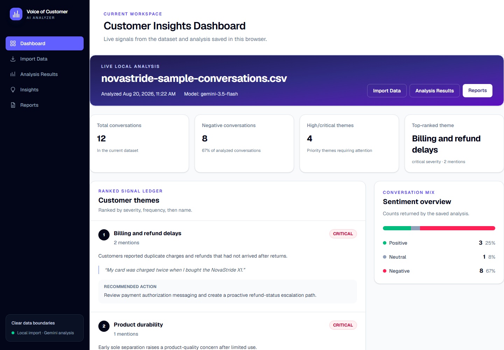
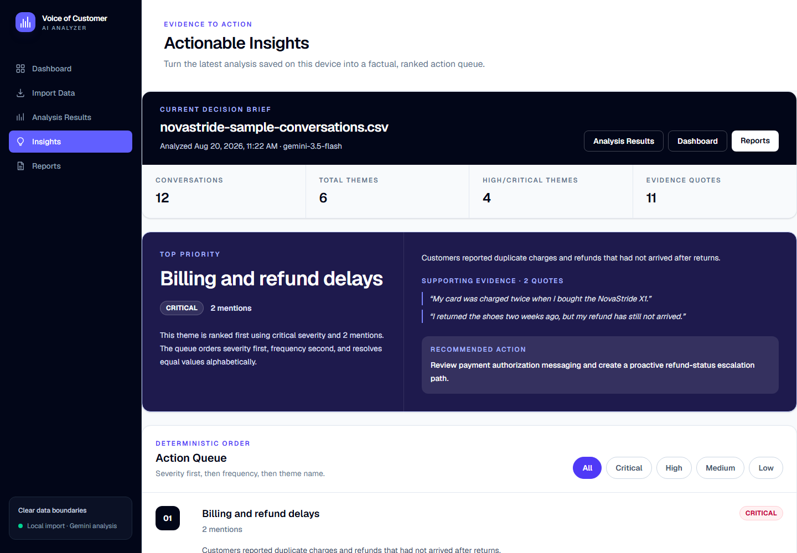
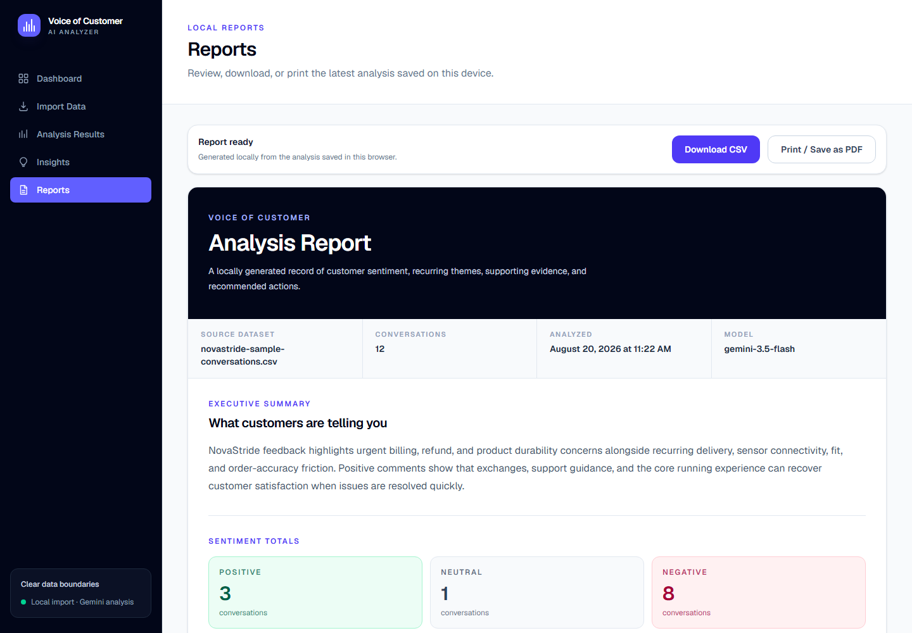

# AI Voice of Customer Analyzer

Turn customer conversation exports into a structured, evidence-backed view of sentiment, recurring themes, and recommended actions. This portfolio application covers the complete workflow—from browser-based CSV/TXT import and validation to server-side Gemini analysis, locally persisted dashboards and insights, and spreadsheet-safe or print-ready reports.

**[Open the live demo](https://ai-voice-of-customer-analyzer.vercel.app)**

> Portfolio demonstration only. The public demo has no authentication and is not intended for production or sensitive data. Use only fictional or anonymized conversations.

## Core features

- Import CSV or TXT files, paste text, or load the included fictional sample dataset.
- Validate and normalize conversation records before continuing.
- Save the current dataset and its matching validated analysis in browser IndexedDB.
- Run structured Gemini analysis for an overall summary, sentiment totals, themes, evidence, severity, and recommended actions.
- Review a live dashboard with deterministic theme ranking and safely rounded sentiment percentages.
- Convert saved model output into a filtered, evidence-backed Actionable Insights queue.
- Generate local reports with formula-injection-safe CSV download and print/save-as-PDF support.
- Detect and remove corrupted or dataset-mismatched saved analyses instead of displaying stale results.

## End-to-end workflow

1. Import and validate customer conversations on the **Import Data** page.
2. Save the normalized dataset to browser IndexedDB and open **Analysis Results**.
3. Explicitly run AI analysis; the selected conversations travel through the server-only API route to Google Gemini.
4. Validate the structured provider response and save the matching result back to IndexedDB.
5. Explore local views in **Dashboard**, **Actionable Insights**, and **Reports**.
6. Download a CSV report or use the browser print dialog to save a PDF locally.

## Screenshots

All screenshots use the included fictional NovaStride dataset and a schema-valid fictional analysis.

### Dashboard



### Actionable Insights



### Reports



## Technology stack

- Next.js 16 App Router and React 19
- TypeScript
- Tailwind CSS 4
- Google Gen AI SDK (`@google/genai`)
- Native browser IndexedDB
- Papa Parse for CSV parsing
- Vercel deployment

## Architecture

```text
CSV / TXT / pasted text / sample
              │
              ▼
    Browser validation and normalization
              │
              ▼
      IndexedDB: current dataset
              │
       explicit “Run Analysis”
              │
              ▼
 Next.js POST /api/analyze (server only)
              │
              ▼
       Google Gemini structured JSON
              │
     server + client validation
              ▼
 IndexedDB: matching saved analysis
              │
      ┌───────┼──────────┐
      ▼       ▼          ▼
 Dashboard  Insights   Reports / exports
```

The Gemini API key is accessed only by the server-only Gemini module. Dashboard, Insights, Reports, CSV generation, PDF printing, matching checks, sorting, filtering, and percentage calculations run locally without another provider request.

## Local installation

Requirements: Node.js and npm.

From a local checkout of this repository:

```bash
cd ai-voice-of-customer-analyzer
npm install
```

Create `.env.local` in the repository root:

```dotenv
GEMINI_API_KEY=your_gemini_api_key
```

Never prefix this variable with `NEXT_PUBLIC_`, and never commit `.env.local`.

Start the development server:

```bash
npm run dev
```

Open [http://localhost:3000](http://localhost:3000). Useful checks are:

```bash
npm run lint
npm run build
```

## Deploying to Vercel

1. Import the repository into Vercel.
2. Add `GEMINI_API_KEY` in **Project Settings → Environment Variables** for each desired deployment environment.
3. Deploy using the detected Next.js settings.
4. Confirm the import workflow and `/api/analyze` using fictional data.

No additional database or paid infrastructure is required for this portfolio deployment.

## Fictional sample dataset

[`public/sample-conversations.csv`](public/sample-conversations.csv) contains 12 fictional NovaStride X1 support conversations across web chat, chatbot, in-app chat, and email. It covers delivery, sizing, billing, sensor pairing, comfort, refunds, order accuracy, promotions, durability, successful exchanges, and positive product feedback. Load it from the Import page or download it directly from the repository.

## Privacy and security boundaries

- Imported datasets and saved analyses remain in the visitor's browser IndexedDB.
- Selected conversations are sent through the application server to Google Gemini only when the visitor explicitly runs analysis.
- Reports, CSV files, and print/PDF exports are generated locally in the browser.
- `GEMINI_API_KEY` remains server-only and API errors are sanitized.
- Analysis requests have conversation-count and text-size limits, non-cacheable responses, and an in-memory burst limiter.
- Security headers restrict framing, MIME sniffing, referrer leakage, and unnecessary browser capabilities.
- The public demo has no authentication. Use only fictional or anonymized data; never submit credentials, confidential records, regulated data, or personally identifiable information.

## Known limitations

- This is a portfolio demonstration and is not suitable for production use.
- There are no user accounts, roles, access controls, or shared workspaces.
- IndexedDB data is specific to the current browser profile and origin and can be cleared by the browser or visitor.
- AI results are not guaranteed to be complete or correct and should be reviewed by a person.
- The in-memory rate limiter is instance-local. It resets on cold starts or deployments and is not shared across Vercel serverless instances, so it is not production-grade abuse prevention.
- PDF output relies on the browser's print/save-as-PDF capability rather than a dedicated PDF renderer.

## Verification

The repository is verified with:

- ESLint via `npm run lint`
- Next.js production compilation and TypeScript checks via `npm run build`
- Browser-level tests for IndexedDB persistence, dataset matching, dashboard calculations, insight ranking and filters, report rendering, CSV escaping/formula protection, and print layout
- Real server-route smoke testing with fictional conversations, including structured response validation and HTTP 429 behavior
